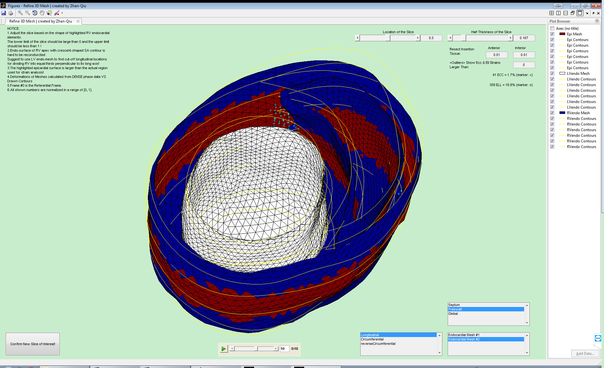

## 3D DENSE Plugin for Crescent Organ
[*DENSEanalysis*](https://github.com/denseanalysis/denseanalysis) Affiliate Plugin for 3D Finite Element Meshing, Deformation Visualization, and Biomechanics Quantification of a Crescent-Shaped Organ from Cine **d**isplacement **en**coding with **s**timulated **e**choes (DENSE) MRI Images



### Applications
- Right ventricle of small animals like rodent, which have a much more crescent-shaped cavity
- The heart in which the bi-ventricular shape is sharper at the right ventricle insertion points

### Features
* Iteration Algorithm for Finite Element Mesh Growing towards its Actual Crescent Shape
* Precise Segmentation of Right Ventricular Free Wall from Left Ventricular Free Wall (by taking the fact into account that the anterior and inferior insertions of the RV to the LV shift circumferentially along the ventricular long axis)
* A Graphical User Interface for User-defined Noise Suppression
* A Graphical User Interface for Selecting the Finite Elements of Interest and Visualizing their Deformation 

### Requirements
- [*DENSEanalysis*](https://github.com/denseanalysis/denseanalysis) 
	- The core software required for running the plugin
	- Export 2D contours as inputs for the plugin 
- The bi-ventricular branch of [*DENSE3D Plugin*](https://github.com/suever/dense3D_plugin/tree/biventricular)
	- Call the scripts under the private directory inside it

### Compatibility
Compatible with [v0.5.0](https://github.com/denseanalysis/denseanalysis/blob/master/CHANGELOG) of [*DENSEanalysis*](https://github.com/denseanalysis/denseanalysis)

### Installation
After installation of [*DENSEanalysis*](https://github.com/denseanalysis/denseanalysis) and the bi-ventricular branch of [*DENSE3D Plugin*](https://github.com/suever/dense3D_plugin/tree/biventricular), run the following from the MATLAB command line:

```matlab
plugins.PluginManager.import('https://github.com/MMoTH/DENSE3D_Plugin_4CrescentOrgan')
```

>**NOTE**: For analysis only, click once `Initialize DENSE3DPlugin4CrescentOrgan` under the menu tab `Plugin_DENSE3D4CrescentOrgan` every time [*DENSEanalysis*](https://github.com/denseanalysis/denseanalysis) is ran.

### Credits
- This package was created with the [*denseanalysis_plugin_demo*](https://github.com/denseanalysis/denseanalysis_plugin_demo) project template.
- Copyright (c) of the following modified Matlab scripts belongs to [*DENSEanalysis*](https://github.com/denseanalysis/denseanalysis) Contributors and [Zhan-Qiu Liu](mailto:lafeir.lew@gmail.com):
	- [`wrapMesh.m`](wrapMesh.m), [`circumferentialParameterize.m`](circumferentialParameterize.m),  [`computeStrains.m`](computeStrains.m), [`analysisFcnREPL.m`](analysisFcnREPL.m), [`spl2strainFcnREPL.m`](spl2strainFcnREPL.m), [`exportMatREPL.m`](exportMatREPL.m), [`MeshControl.m`](MeshControl.m), and [`linearInterp.m`](linearInterp.m)
- Copyright (c) of the following original Matlab scripts solely belongs to [*DENSEanalysis*](https://github.com/denseanalysis/denseanalysis) Contributors:
	- [`contourDataREPL.m`](contourDataREPL.m), [`computeTransmuralDataREPL.m`](computeTransmuralDataREPL.m), [`resetFcnREPL.m`](resetFcnREPL.m), [`switchstateREPL.m`](switchstateREPL.m), and [`animatedgif.m`](animatedgif.m)
- Copyright (c) of the following original Matlab scripts solely belongs to [*CardiacKinematicsPhantom*](https://github.com/luigiemp/CardiacKinematicsPhantom) Contributors:
	- [`VectorsToVTK.m`](VectorsToVTK.m)

### Attribution

You are welcome to use the *DENSE3D_Plugin_4CrescentOrgan* in your research provided that you include the following citation in your work:
>Zhan-Qiu Liu, Xiaoyan Zhang, and Jonathan F. Wenk, 2019, "Quantification of Regional Right Ventricular Strain in Healthy Rats using 3D Spiral Cine DENSE MRI", Journal of Biomechanics, 94, pp.219-223.
>
>Zhan-Qiu Liu(2018). 3D DENSE Plugin for Crescent Organ. Retrieved
>from https://github.com/Zhan-Qiu-Liu/DENSE3D_Plugin_4CrescentOrgan


### Known Bugs

### Known Issues
1.Error in plugins.PluginMenu/checkAvailability

Temporal Solution: Disable checkAvailability
